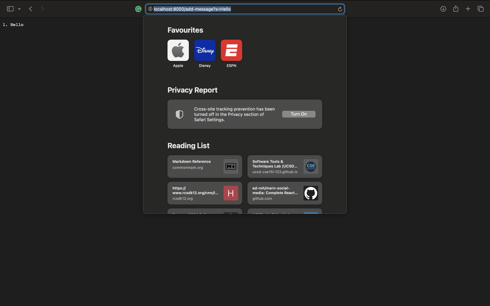
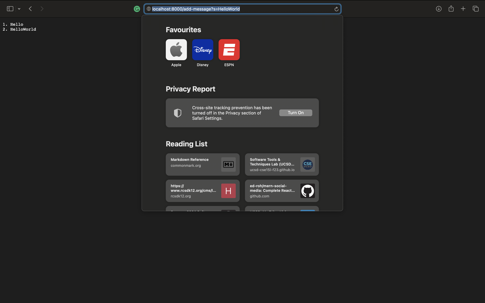
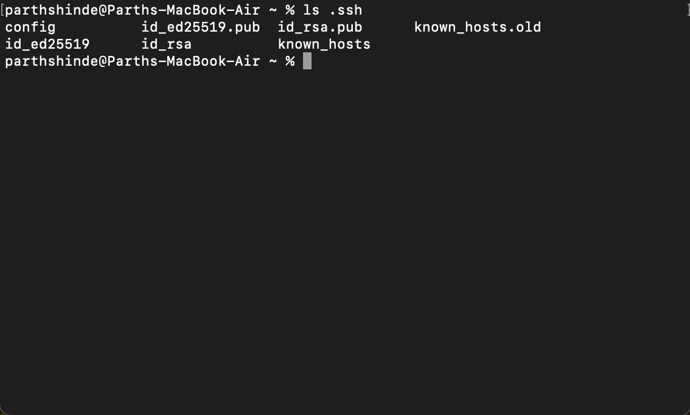
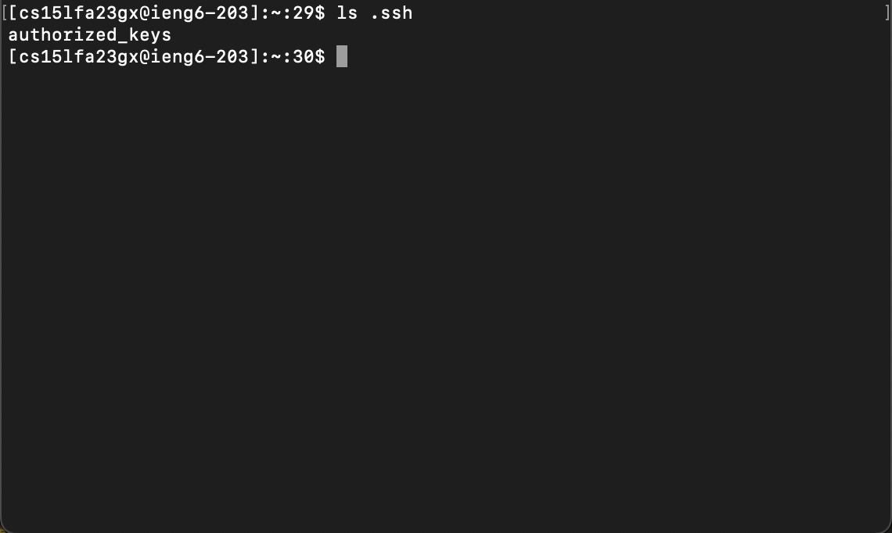
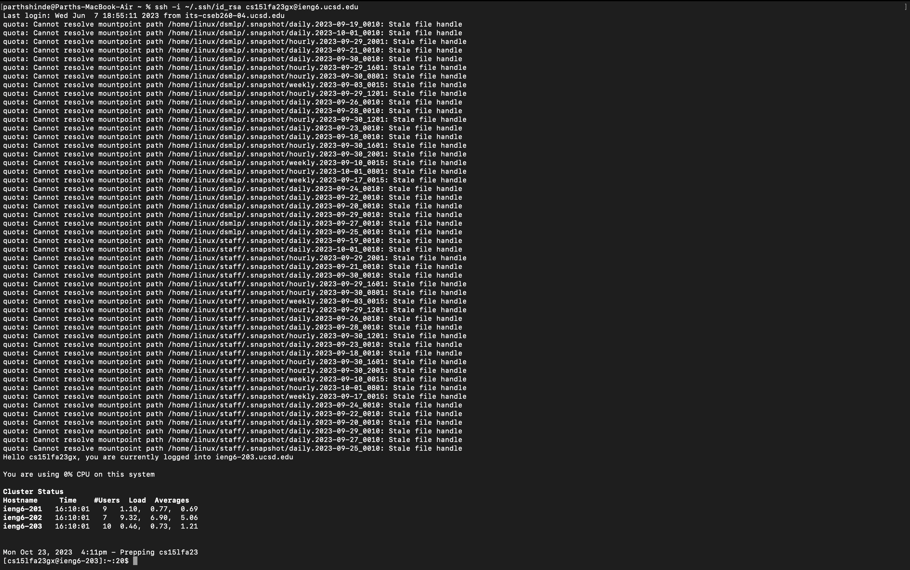

# Lab Report 2 - Servers and SSH Keys

## 1. StringServer and URIs

Here is my code for StringServer.

```
import com.sun.net.httpserver.HttpServer;
import com.sun.net.httpserver.HttpHandler;
import com.sun.net.httpserver.HttpExchange;

import java.io.IOException;
import java.io.OutputStream;
import java.net.InetSocketAddress;
import java.nio.charset.StandardCharsets;
import java.util.concurrent.atomic.AtomicInteger;

public class StringServer {

    private static final String RESPONSE_TEMPLATE = "%d. %s\n";
    private static final AtomicInteger messageCount = new AtomicInteger(0);
    private static final StringBuilder messages = new StringBuilder();

    public static void main(String[] args) throws IOException {
        HttpServer server = HttpServer.create(new InetSocketAddress(8000), 0);

        server.createContext("/add-message", new AddMessageHandler());

        server.start();
        System.out.println("Server started on port 8000");
    }

    static class AddMessageHandler implements HttpHandler {
        @Override
        public void handle(HttpExchange exchange) throws IOException {
            String queryParams = exchange.getRequestURI().getQuery();
            String message = null;

            if (queryParams != null) {
                for (String param : queryParams.split("&")) {
                    String[] pair = param.split("=");
                    if (pair.length == 2 && pair[0].equals("s")) {
                        message = pair[1].replaceAll("\\+", " ");
                    }
                }
            }

            if (message == null) {
                String response = "Bad Request: missing 's' query parameter";
                exchange.sendResponseHeaders(400, response.length());
                try (OutputStream os = exchange.getResponseBody()) {
                    os.write(response.getBytes());
                }
                return;
            }

            synchronized (messages) {
                messages.append(String.format(RESPONSE_TEMPLATE, messageCount.incrementAndGet(), message));
            }

            byte[] response = messages.toString().getBytes(StandardCharsets.UTF_8);
            exchange.sendResponseHeaders(200, response.length);
            try (OutputStream os = exchange.getResponseBody()) {
                os.write(response);
            }
        }
    }
}
```

Here is a example of me using `/add-message` for the first time:


1. The `handleRequest` method is called, with the `url` argument being a URI created from the request "/add-message?s=Hello"
2. The `log` field starts out empty, and `nextNum` starts out as 1
3. The `log` field gets updated to "1. Hello\n" and `nextNum` gets incremented to 2

For the second screenshot:

1. The `handleRequest` method is called again, this time with the `url` argument being a URI created from "/add-message?s=HelloWorld"
2. `log` contains "1. Hello\n" before the request, and `nextNum` is 2
3. `log` gets updated to contain both messages, and `nextNum` is incremented to 3

## 2. SSH Keys

1. Here is the private key on my computer:


2. Here is the public key on ieng6:


3. Here is logging in without a password:


## 3. Things I learned

Something I learned is how to set up SSH keys to log into remote servers without using a password. I didn't know about SSH keys before, but now I understand how the public and private keys allow you to securely authenticate without transmitting your password over the network. I also learned about runnning a server using code.

---
