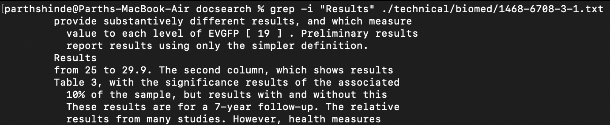
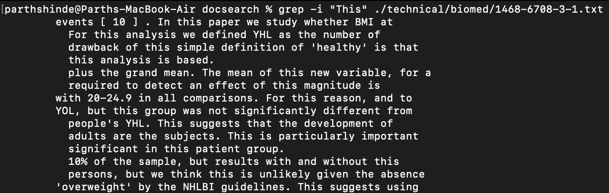
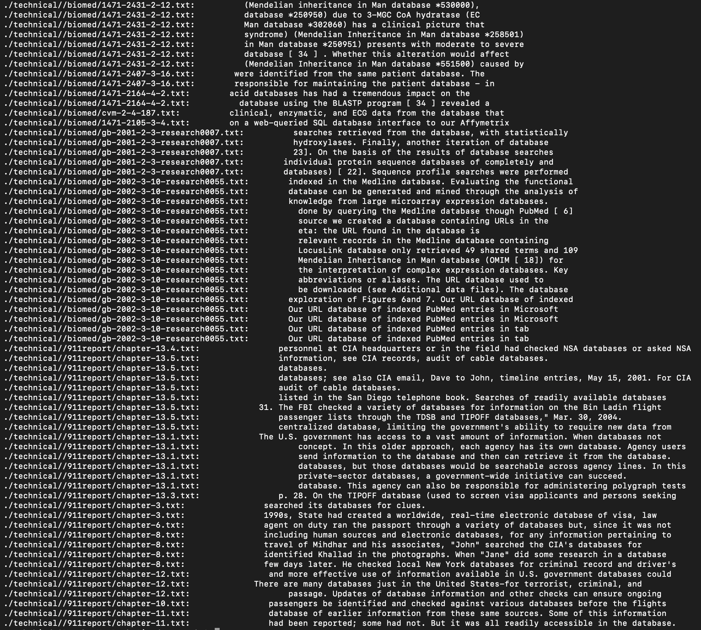
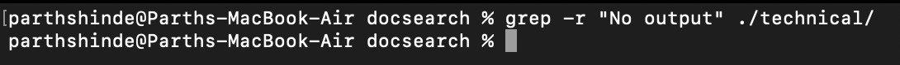
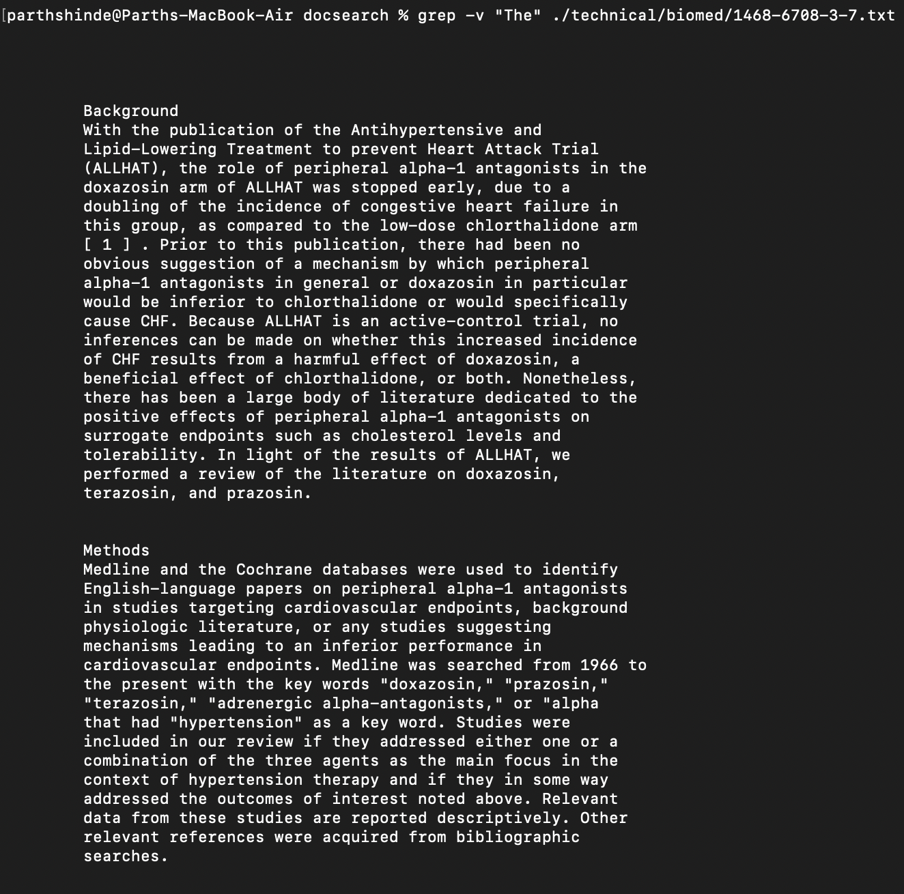
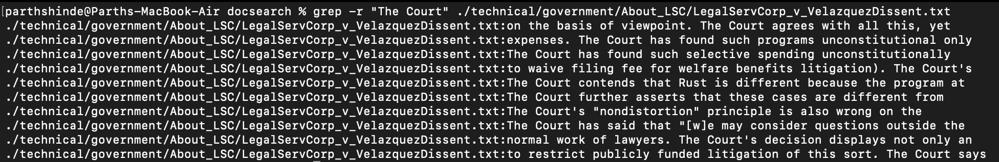
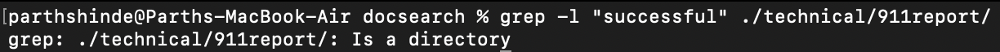
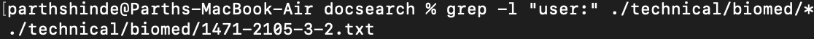

## Part 2

For Part 2, I have decided to focus on `grep` command. It is used to search texts using patterns.

### 1: `-i` (Ignoring Case)

**Explanation:** The `-i` option makes grep perform case-insensitive searches.

**Example 1:** 

```
grep -i "Results" ./technical/biomed/1468-6708-3-1.txt
```

This is a photo of the output:


**Example 2:** 

```
grep -i "This" ./technical/biomed/1468-6708-3-1.txt
```

This is a photo of the output:


### 2: `-r` (Recursive)

**Explanation:** The `-r` option allows grep to search recursively through directories.

**Example 1:** 

```
grep -r "database" ./technical/
```

This is a photo of the output (There are more lines of output but this is a section of it):


**Example 2:** 

```
grep -r "No output" ./technical/
```

This is a photo of the output (No output):


### 4: `-l` (Files With Matches)

**Explanation:** The `-l` option lists the names of files with matching lines, rather than the lines themselves.

**Example 1:** 

```
grep -v "The" ./technical/biomed/1468-6708-3-7.txt
```

This is a photo of the output:


**Example 2:** 

```
grep -r "The Court" ./technical/government/About_LSC/LegalServCorp_v_VelazquezDissent.txt
```

This is a photo of the output:


### 4: `-l` (Files With Matches)

**Explanation:** The `-l` option lists the names of files with matching lines, rather than the lines themselves.

**Example 1:** 

```
grep -l "successful" ./technical/911report/
```

This is a photo of the output:


**Example 2:** 

```
grep -l "user:" ./technical/biomed/*
```

This is a photo of the output:
